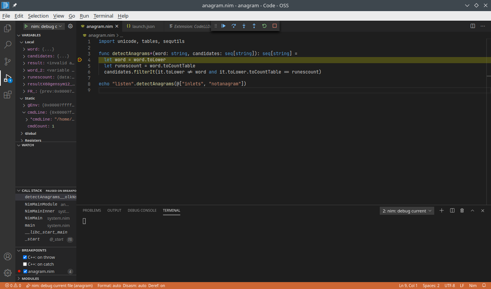

# Nim Extension

Visual Studio: 
[](https://marketplace.visualstudio.com/items?itemName=nimsaem.nimvscode)
[](https://marketplace.visualstudio.com/items?itemName=nimsaem.nimvscode)
[](https://vsmarketplacebadge.apphb.com/rating/nimsaem.nimvscode.svg)

Open-VSX: 
[](https://open-vsx.org/extension/nimsaem/nimvscode)
[](https://open-vsx.org/extension/nimsaem/nimvscode)
[](https://open-vsx.org/extension/nimsaem/nimvscode)

This extension adds language support for the Nim language to VS Code, including:

- Syntax Highlight (nim, nimble, nim.cfg)
- Code Completion
- Signature Help
- Goto Definition
- Find References
- File outline
- Build-on-save
- Workspace symbol search
- Quick info
- Problem Matchers for nim compiler and test output
- Nim check result reported in `Nim` output channel (great for macro development) <details><summary>demo</summary></details>

[Read how it differs](#history--trivia) from other Nim extensions, of which there are a surprising number.

## History & Trivia

This extension started out as a [Nim port](https://github.com/pragmagic/vscode-nim/issues/172) of an extension written in [TypeScript](https://marketplace.visualstudio.com/items?itemName=kosz78.nim) for the Nim language. The port was done as a learning exercise for myself (@saem) and also meant to allow the community to contribute to it more easily. For the "full museum" experience be sure to checkout the [original announcement](https://forum.nim-lang.org/t/6862#42899) on the nim forums. This entire section wouldn't be here if it wasn't for [cpbotha's post suggesting it](https://forum.nim-lang.org/t/7242#45847), thanks.

Since then community members (noteably: @RSDuck, @dscottboggs, and yours truly) have made various contributions directly to this version. From bug fixes to small enhancements.

Presently (2020-12-13) the difference between the two extensions is likley not particularly noticeable to the casual user, arguably it's seen more active maintenance. Some differences you might notice:
* diagnostics for macro based errors
* log highlighting and problem detection with links to source code
* `nimsuggest` and `nim check` take backend into account so JS projects
* IPC and process management for nimsuggest seem to handle more edge cases
* support for multi-folder workspaces
* uses vscode extension storage instead of `/tmp` (seems insecure)
* can confirm that debugging native code is possible with this extension (at least Linux GDB)

For anyone who might wish to see heavy JavaScript or NodeJS interop example or submit a small patch the difference is significant:

* likely the most complete FFI for the VS Code API
* likely the most complete FFI for NodeJS and a number of ES6 APIs
* lots of examples of Promise and async APIs -- admittedly not pretty
* it's written in Nim -- warning there is still a lot of "my first Nim code"
* the build tooling is nimble -- presently not released as a package
* a horrible port of flatdb for nodejs

Here is one of those really convincing testamonials as a conclusion:
> I learned some Nim, a bit about VS Code extensions, got a useful Nim editor, and it might help someone else. Not bad.
> -- Saem

## Using

First, you will need to install [Visual Studio Code](https://code.visualstudio.com/) `1.27.0` or higher.
In the command palette (`cmd-shift-p`) select `Install Extension` and choose `Nim`.

The following tools are required for the extension:
* Nim compiler - http://nim-lang.org

_Note_: It is recommended to turn `Auto Save` on in Visual Studio Code (`File -> Auto Save`) when using this extension.

### Options

The following Visual Studio Code settings are available for the Nim extension.  These can be set in user preferences (`cmd+,`) or workspace settings (`.vscode/settings.json`).
* `nim.buildOnSave` - perform build task from `tasks.json` file, to use this options you need declare build task according to [Tasks Documentation](https://code.visualstudio.com/docs/editor/tasks), for example:
	```json
	{
	   "taskName": "Run module.nim",
	   "command": "nim",
	   "args": ["c", "-o:bin/${fileBasenameNoExtension}", "-r", "${fileBasename}"],
	   "options": {
	      "cwd": "${workspaceRoot}"
	   },
	   "type": "shell",
	   "group": {
	      "kind": "build",
	      "isDefault": true
	   }
	}
	```
* `nim.lintOnSave` - perform the project check for errors on save
* `nim.project` - optional array of projects file, if nim.project is not defined then all nim files will be used as separate project
* `nim.licenseString` - optional license text that will be inserted on nim file creation


#### Example

```json
{
	"nim.buildOnSave": false,
	"nim.buildCommand": "c",
	"nim.lintOnSave": true,
	"nim.project": ["project.nim", "project2.nim"],
	"nim.licenseString": "# Copyright 2020.\n\n"
}
```

### Commands
The following commands are provided by the extension:

* `Nim: Run selected file` - compile and run selected file, it uses `c` compiler by default, but you can specify `cpp` in `nim.buildCommand` config parameter.
This command available from file context menu or by `F6` keyboard shortcut.

---
### Debugging
Visual Studio Code inclues a powerful debugging system, and the Nim tooling can take advantage of that. However, in order to do so, some setup is required.

#### Setting up
First, install a debugging extension, such as [CodeLLDB](https://open-vsx.org/extension/vadimcn/vscode-lldb), and any native packages the extension may require (such as clang and lldb).

Next, you need to create a `tasks.json` file for your project, under the `.vscode` directory of your project root. Here is an example for CodeLLDB:
```jsonc
// .vscode/tasks.json
{
    "version": "2.0.0",
    "tasks": [
        {
            "label": "nim: build current file (for debugging)",
            "command": "nim",
            "args": [
                "compile",
                "-g",
                "--debugger:native",
                "-o:${workspaceRoot}/bin/${fileBasenameNoExtension}",
                "${relativeFile}"
            ],
            "options": {
                "cwd": "${workspaceRoot}"
            },
            "type": "shell",
        }
    ]
}
```

Then, you need to create a launch configuration in the project's launch.json file. Again, this example works with CodeLLDB:
```jsonc
// .vscode/launch.json
{
	"version": "0.2.0",
	"configurations": [
		{
			"type": "lldb",
			"request": "launch",
			"name": "nim: debug current file",
			"preLaunchTask": "nim: build current file (for debugging)",
			"program": "${workspaceFolder}/bin/${fileBasenameNoExtension}",
			"args": [],
			"cwd": "${workspaceFolder}",
		}
	]
}
```

You should be set up now to be able to debug from a given file in the native VS Code(ium) debugger.



---
## TODO

* Clean-up
  * Correctly model various nim project concepts
  * Convert to asyncjs API
* Extract most functionality into an LSP (check existing one)
* Extract Visual Studio Code API into a separate Nimble package
  * Switch to using concepts for interfaces

## ChangeLog

ChangeLog is located [here](https://github.com/saem/vscode-nim/blob/master/CHANGELOG.md)

